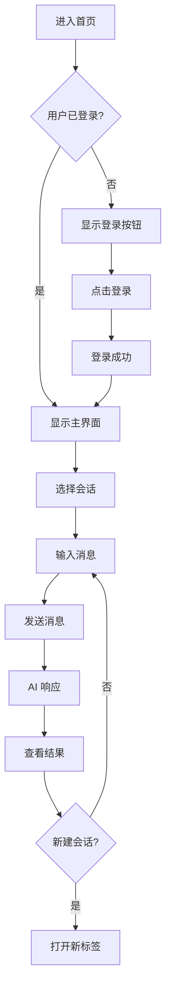

## 1. Product Overview
AI 助手对话界面，类似 Google Gemini，支持多会话管理、用户登录、智能体对话等核心功能。
- 为用户提供智能对话服务，支持多会话并行处理
- 简洁优雅的深色主题设计，提升用户体验

## 2. Core Features

### 2.1 User Roles
| Role | Registration Method | Core Permissions |
|------|---------------------|------------------|
| Normal User | Email/password login | Use AI chat features, view conversation history |
| Guest | No registration | Use basic chat features |

### 2.2 Feature Module
1. **主页面**: 多会话标签、对话区域、输入框、左侧导航
2. **登录功能**: 用户认证，登录后隐藏登录按钮

### 2.3 Page Details
| Page Name | Module Name | Feature description |
|-----------|-------------|---------------------|
| 主页面 | 会话标签栏 | 支持打开多个会话标签，切换和关闭会话 |
| 主页面 | 左侧导航 | 软件图标、智能体对话入口、会话历史列表 |
| 主页面 | 对话区域 | 显示消息列表，支持流式响应 |
| 主页面 | 输入框 | 文本输入，发送消息 |
| 主页面 | 登录按钮 | 右上角登录按钮，登录后隐藏 |

## 3. Core Process
用户进入页面 → 查看左侧导航 → 选择智能体对话 → 在输入框输入消息 → AI 返回响应 → 可打开新会话或查看历史会话

## 4. User Interface Design

### 4.1 Design Style
- **主色调**: 深色主题，黑色背景，渐变效果
- **次要颜色**: 黑色
- **按钮风格**: 圆角、渐变背景、hover 效果
- **字体**: 现代无衬线字体，清晰可读
- **布局风格**: 左侧导航 + 顶部标签 + 主内容区
- **图标**: 使用 lucide-react 图标库

### 4.2 Page Design Overview
| Page Name | Module Name | UI Elements |
|-----------|-------------|-------------|
| 主页面 | 顶部标签栏 | 多个会话标签，"+" 新建按钮 |
| 主页面 | 右上角 | 登录按钮（未登录时显示），用户头像（登录后显示） |
| 主页面 | 左侧导航 | 软件图标、智能体对话按钮、会话历史列表 |
| 主页面 | 对话区域 | 消息气泡，用户和 AI 消息区分 |
| 主页面 | 底部输入框 | 圆角输入框，发送按钮，语音按钮 |

### 4.3 Responsiveness
- 桌面优先设计
- 支持响应式布局，移动端自动调整

### 4.4 Visual Effects
- 背景渐变效果
- 消息气泡动画
- 标签切换动画
- 按钮 hover 效果
