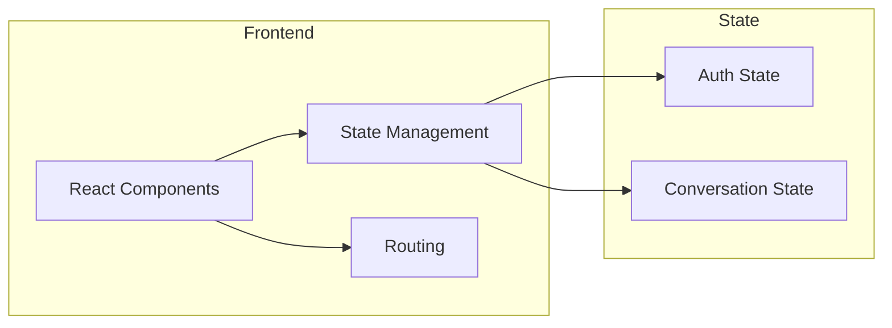
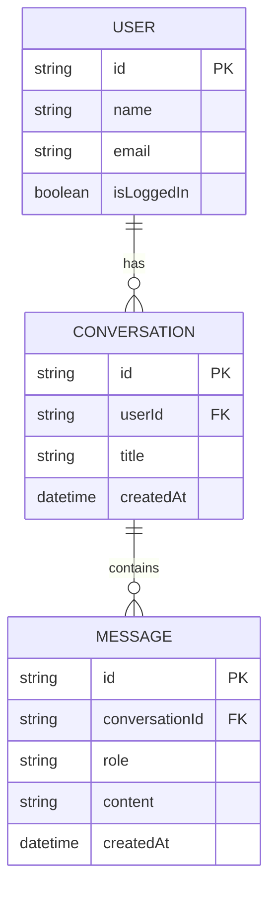

## 1. Architecture Design

## 2. Technology Description
- Frontend: React@18 + TypeScript + TailwindCSS@3 + Vite
- State Management: Zustand
- Icons: lucide-react
- Authentication: Mock authentication (local state)
- No backend required for this demo

## 3. Route Definitions
| Route | Purpose |
|-------|---------|
| / | Main chat interface |

## 4. API Definitions
No external API required for demo. Mock data used for conversations.

## 5. Data Model
### 5.1 Data Model Definition

### 5.2 Initial Data
- Mock user data
- Mock conversation history
- Mock message data
